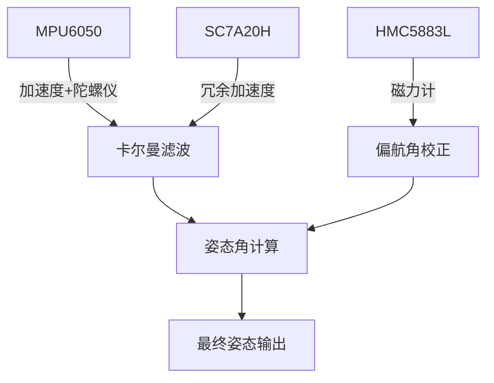

# ESP32-S3 MPU6050 + HMC5883L 传感器融合项目

基于ESP-IDF开发的ESP32-S3传感器数据融合项目，实现姿态角计算功能。

## 硬件配置
- 开发板：ESP32-S3
- 传感器：
  - MPU6050：6轴加速度计/陀螺仪
  - HMC5883L：3轴磁力计
  - SC7A20H：3轴加速度计(新增)
- 通信接口：I2C

## 功能特性
1. 实时读取MPU6050和HMC5883L传感器数据
2. 传感器数据融合算法
3. 姿态角计算：
   - 翻滚角(Roll)
   - 横滚角(Pitch) 
   - 俯仰角(Yaw)
4. 通过串口输出姿态数据

## 项目结构
```
├── components
│   ├── BUS/          # I2C总线驱动
│   ├── hmc5883l/     # 磁力计驱动
│   ├── my_mpu6050/   # MPU6050驱动
│   ├── sc7a20h/      # SC7A20H加速度计驱动(新增)
│   └── sensor_fusion/ # 传感器融合算法(新增)
├── main/             # 主应用程序
└── managed_components/
    └── espressif__mpu6050  # 官方MPU6050组件
```

## 使用方法
1. 连接硬件：
   - MPU6050: SCL→GPIO12, SDA→GPIO11, VCC→3.3V, GND→GND
   - HMC5883L: SCL→GPIO12, SDA→GPIO11, VCC→3.3V, GND→GND
   - SC7A20H: SCL→GPIO12, SDA→GPIO11, VCC→3.3V, GND→GND(新增)

2. 编译烧录：
```bash
idf.py build
idf.py -p PORT flash monitor
```

3. 串口输出：
```
Roll: 12.34° | Pitch: 5.67° | Yaw: 89.01°
```

## 算法说明
详细算法实现请参考: [传感器融合算法文档](./docs/sensor_fusion_algorithm.md)

### 三传感器数据融合算法

#### 1. 算法架构


#### 2. 卡尔曼滤波实现
- **状态向量**: [ax, ay, az, gx, gy, gz]
- **测量向量**: [mpu_accel, mpu_gyro, sc7a20h_accel]
- **关键步骤**:
  1. 预测阶段: 根据陀螺仪数据预测状态
  2. 更新阶段: 融合加速度计数据更新状态
  3. 磁力计校正: 单独校正偏航角

#### 3. 技术难点
⚠️ **难点1**: 传感器坐标系对齐
- 需统一MPU6050/HMC5883L/SC7A20H的坐标系
- 解决方法: 在驱动层进行坐标转换

⚠️ **难点2**: 时间同步
- 三传感器采样时间不一致
- 解决方法: 使用时间戳加权融合

⚠️ **难点3**: 卡尔曼滤波稳定性
- 过程噪声(Q)和测量噪声(R)矩阵调参困难
- 解决方法: 采用自适应滤波算法

#### 4. 性能优化
- 使用定点数运算加速矩阵计算
- 采用6x6简化协方差矩阵
- 预计算常用三角函数值

## 依赖项
- ESP-IDF v5.0+
- MPU6050组件(espressif/mpu6050)

## 更新日志

### 2025-04-24
- 新增SC7A20H加速度计支持
  - 添加sc7a20h组件驱动
  - 更新I2C总线配置支持多设备
- 新增传感器融合算法
  - 添加sensor_fusion组件
  - 实现三传感器数据融合

### 2025-04-22
- 修复MPU6050初始化问题
  - 移除main.c中的冗余全局变量定义
  - 在my_mpu6050模块中添加获取设备句柄接口
  - 统一通过my_mpu6050_get_handle()访问MPU6050设备
  - 解决因NULL指针访问导致的LoadProhibited异常
