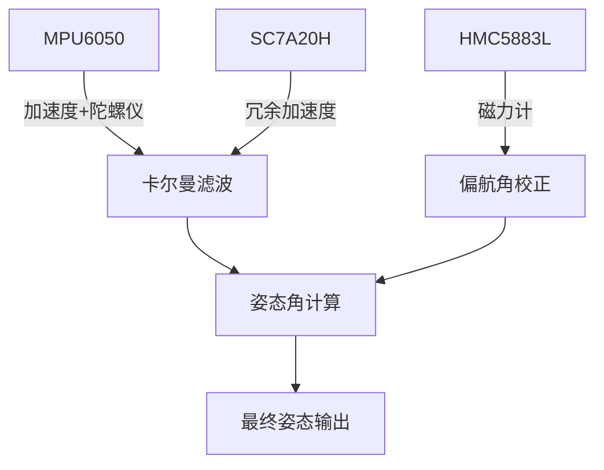

# 三传感器数据融合算法文档

## 1. 算法概述
本系统采用卡尔曼滤波融合MPU6050(加速度计+陀螺仪)、HMC5883L(磁力计)和SC7A20H(加速度计)的数据，计算设备的三轴姿态角。

## 2. 算法架构


## 3. 核心算法实现

### 3.1 卡尔曼滤波
- **状态向量**: 6维 [ax, ay, az, gx, gy, gz]
- **测量向量**: 9维 [mpu_accel(3), mpu_gyro(3), sc7a20h_accel(3)]
- **关键矩阵**:
  - Q: 过程噪声协方差(6x6)
  - R: 测量噪声协方差(9x9) 
  - P: 误差协方差(6x6)

### 3.2 四元数转换
```c
// 四元数转欧拉角
attitude_t quat_to_euler(float q[4]) {
    attitude_t att;
    att.roll = atan2f(2*(q0*q1 + q2*q3), 1-2*(q1*q1+q2*q2));
    att.pitch = asinf(2*(q0*q2 - q3*q1));
    att.yaw = atan2f(2*(q0*q3 + q1*q2), 1-2*(q2*q2+q3*q3));
    // 转换为角度制...
}
```

## 4. 技术难点与解决方案

### ⚠️ 难点1: 传感器坐标系对齐
- **问题**: 各传感器坐标系定义不一致
- **解决方案**:
  1. 在驱动层统一转换为东北天(ENU)坐标系
  2. 增加坐标系转换校验函数

### ⚠️ 难点2: 时间同步
- **问题**: 传感器采样频率不同(MPU:1kHz, HMC:100Hz)
- **解决方案**:
  1. 采用时间戳加权融合
  2. 设置数据有效期(10ms)

### ⚠️ 难点3: 滤波稳定性
- **问题**: 剧烈运动时卡尔曼滤波发散
- **解决方案**:
  1. 自适应Q/R矩阵参数
  2. 增加运动状态检测

## 5. 性能优化
1. 采用6x6简化协方差矩阵
2. 使用快速平方根倒数算法
3. 预计算三角函数值
4. 定点数优化(ESP32单精度FPU)